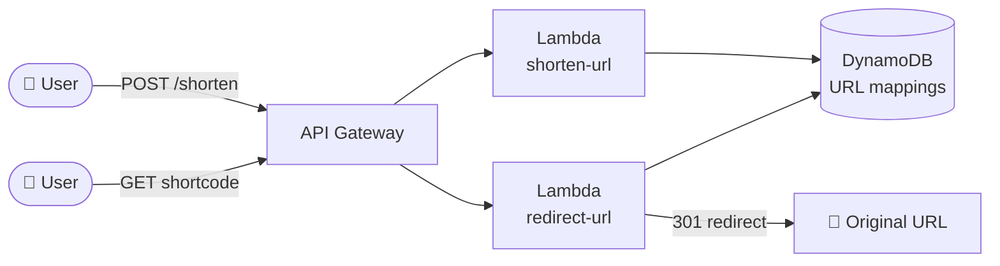

# 🚀 Shortify – Serverless URL Shortener

> A production-ready serverless URL shortener built on AWS using modern DevOps practices, Infrastructure as Code, and CI/CD automation.

Built as part of my hands-on DevOps engineering portfolio to demonstrate cloud architecture, serverless computing, automation, security, and observability.

---

# 📖 Project Overview

Traditional URL shorteners require servers to deploy, patch, scale, and maintain.

**Shortify** eliminates that operational overhead by using a fully serverless architecture built entirely on AWS.

The application automatically:

- Generates short URLs
- Redirects users to the original URL
- Tracks click counts
- Scales automatically
- Requires zero server management

---

# 🏗️ Architecture


```
                    User
                      │
                      ▼
           Amazon API Gateway (HTTP API)
                │               │
                ▼               ▼
        Create Link Lambda   Redirect Lambda
                │               │
                └───────┬───────┘
                        ▼
                 Amazon DynamoDB
```

Infrastructure is provisioned entirely with **Terraform**.

Terraform state is stored remotely in **Amazon S3** with state locking enabled.

---

# ☁️ AWS Services Used

| Service | Purpose |
|----------|---------|
| API Gateway | Exposes HTTP endpoints |
| AWS Lambda | Runs serverless application logic |
| DynamoDB | Stores URLs and click statistics |
| IAM | Least-privilege execution permissions |
| CloudWatch | Monitoring, metrics and alarms |
| S3 | Terraform remote state storage |
| Terraform | Infrastructure provisioning |
| GitHub Actions | Continuous Integration & Continuous Deployment |

---

# ✨ Features

- Serverless architecture
- Infrastructure as Code
- Automatic scaling
- Click tracking
- Remote Terraform state
- CI/CD pipeline
- Least-privilege IAM
- CloudWatch monitoring
- Production-ready architecture
- 


---

# ⚙️ DevOps Practices Demonstrated

## Infrastructure as Code

Every AWS resource is defined using Terraform.

No infrastructure was manually created through the AWS Console.

---

## Remote State Management

Terraform state is stored remotely in Amazon S3, making infrastructure reproducible and preventing accidental loss of state.

---

## Least-Privilege Security

Each Lambda function has its own IAM role with only the permissions required to perform its task.

---

## Continuous Integration & Deployment

GitHub Actions automatically:

- Installs dependencies
- Initializes Terraform
- Generates execution plans
- Deploys infrastructure

No manual deployment steps are required after pushing to the repository.

---

## Monitoring & Observability

Amazon CloudWatch monitors:

- Lambda errors
- Execution duration
- Function metrics

This provides visibility into application health and performance.

---

# 🌐 API Endpoints

## Create Short URL

**POST**

```
/links
```

Example request

```json
{
  "url": "https://www.example.com"
}
```

Example response

```json
{
  "short_code": "a1b2c3d4"
}
```

---

## Redirect

**GET**

```
/{short_code}
```

Returns:

```
302 Redirect
```

---

# 📂 Project Structure

```
shortify-saas
│
├── backend
│   ├── create_link.js
│   ├── redirect.js
│   └── package.json
│
├── terraform
│   ├── backend.tf
│   ├── providers.tf
│   ├── main.tf
│   ├── variables.tf
│   └── outputs.tf
│
├── .github
│   └── workflows
│       └── deploy.yml
│
├── docs
│   └── architecture.png
│
└── README.md
```

---

# 🚀 Deployment

## Prerequisites

- AWS CLI
- Terraform 1.9+
- Node.js 18+
- AWS Account

---

## Manual Deployment

```bash
cd backend

npm install

cd ../terraform

terraform init

terraform plan

terraform apply
```

---

## Automated Deployment

Simply push changes to the **main** branch.

GitHub Actions automatically deploys the application.

---

# 🛠️ Challenges & Solutions

## Terraform Provider Download Failures

**Problem**

Terraform providers repeatedly failed to download because of unstable internet connectivity.

**Solution**

Repeated the initialization until all providers downloaded successfully.

---

## Incorrect Terraform Binary

**Problem**

Downloaded the Linux binary while working on Windows.

**Solution**

Installed the Windows version of Terraform and added it to the Windows PATH.

---

## Lambda Syntax Errors

**Problem**

Lambda deployment failed because JavaScript files became truncated when saved using Nano.

**Solution**

Replaced Nano with Heredoc (`cat << EOF`) to generate complete source files reliably.

---

## Terraform State Lock Errors

**Problem**

Terraform couldn't acquire a state lock due to an incorrectly configured lock table.

**Solution**

Recreated the DynamoDB lock table with the correct `LockID` partition key.

---

## API Gateway Request Failures

**Problem**

Requests hung indefinitely because copied API URLs contained invalid characters.

**Solution**

Retrieved the endpoint directly from AWS CLI to eliminate copy-paste errors.

---

## CI/CD Pipeline Failures

**Problem**

Deployment failed because of:

- Missing package-lock.json
- Incorrect GitHub Secret names
- Terraform version incompatibility

**Solution**

Debugged each workflow run using GitHub Actions logs until the pipeline completed successfully.

---

## Infrastructure Recovery

**Problem**

Configuration drift caused inconsistent AWS resources.

**Solution**

Destroyed and recreated the infrastructure entirely through Terraform, demonstrating the reliability of Infrastructure as Code.

---

# 📚 Key Lessons Learned

- Infrastructure as Code enables complete infrastructure recovery.
- Remote Terraform state is essential for reliability.
- CI/CD pipelines expose environment-specific issues early.
- Least-privilege IAM significantly improves security.
- CloudWatch provides valuable operational visibility.
- Systematic debugging is more effective than random trial and error.

---

# 🎯 Skills Demonstrated

- AWS Lambda
- API Gateway
- DynamoDB
- IAM
- Terraform
- Infrastructure as Code
- GitHub Actions
- CI/CD
- CloudWatch
- Linux
- Git
- Serverless Architecture

---

# 📈 Future Improvements

- Custom domain support
- User authentication
- URL expiration
- Analytics dashboard
- CloudFront CDN
- AWS WAF integration
- Automated testing
- Multi-environment deployments (Dev, Staging, Production)

---

# 👨‍💻 Author

**Emmanuel Chukwuebuka Orjide**

DevOps Engineer

Building production-ready cloud infrastructure with AWS, Terraform, Docker, Kubernetes, and CI/CD.

GitHub: https://github.com/Chukwuebuka127

LinkedIn: https://www.linkedin.com/posts/emmanuel-orjide-787722366_devops-aws-docker-share-7477699740516696065-PDT0/?utm_source=share&utm_medium=member_android&rcm=ACoAAFrgJ9cBNqxaDXMCDmgliCZdGJ-r6a-QIWo

---

> *"Infrastructure should be reproducible, secure, observable, and automated—not manually configured."*
